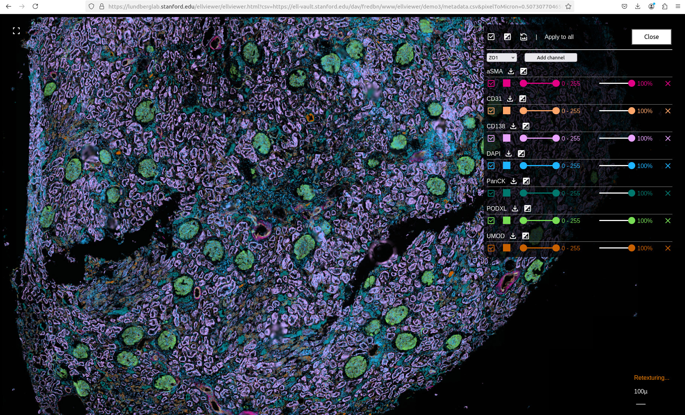
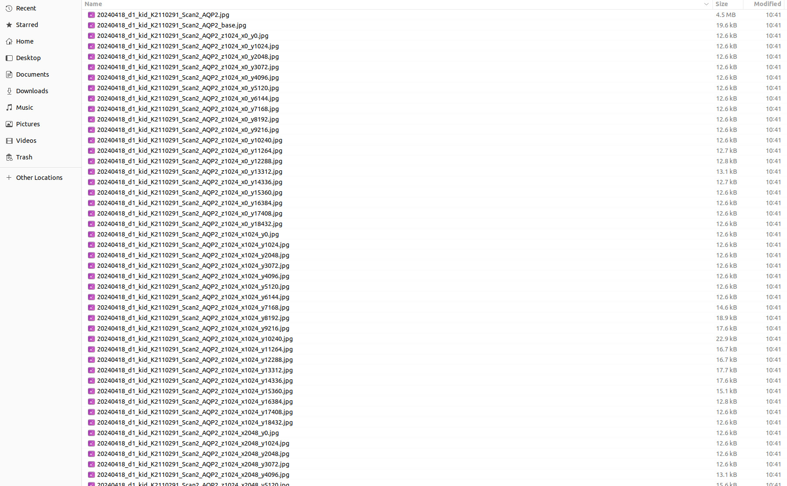

Ellviewer
=========

Ellviewer (Emma Lundberg's lab viewer) is a simple online viewer to easily share your layered images. You just drop your files in any online accessible location and the static HTML viewer will take care of the rest.



Key features
------------

- Serverless Static HMTL viewer that you don't even need to host. That allows you to put a viewer anywhere you can place a URL.
- Zero code configuration. The behavior of the viewer is controlled by a simple CSV file. 
- Uses regular JPG/PNG files or direct image links.
- Adds transparency, coloring and transparency clipping on demand.
- Can display large images using a pyramidal file structure.


How to use it
-------------

Ellviewer works with the following file structure accesible online:
- A CSV file containing the metadata to be loaded/configured in the viewer
- [Optional] The images to be shown. If you use external URLs in the CSV metadata file, you don't need to host the images locally.
- [Optional] The `ellviewer.html` itself. Or you can use our hosted one here: https://lundberglab.stanford.edu/ellviewer/ellviewer.html

Let's check 3 examples of how to do it. You can find extensive information about all possible parameters in the later section.

**Example 1: basic external**:

- Populate and put this `metadata.csv` (you can find the file in the `examples/demo1` repository folder) file accessible online ( for demo purposes, this file is currently hosted in https://ell-vault.stanford.edu/dav/fredbn/www/ellviewer/demo1/metadata.csv ):

```
uri,name,clip,transparency,color,default
https://images.proteinatlas.org/41082/721_D4_1_red.jpg,microtubuli,,1.0,no,yes
https://images.proteinatlas.org/41082/721_D4_1_yellow.jpg,er,,1.0,no,yes
https://images.proteinatlas.org/41082/721_D4_1_blue.jpg,nuclei,,1.0,no,yes
https://images.proteinatlas.org/41082/721_D4_1_green.jpg,protein,,1.0,no,yes
```

- As you can see, the images are plain URLs containing regular jpg files. You can call the viewer just with the following URL: `https://lundberglab.stanford.edu/ellviewer/ellviewer.html?csv=[URL to your accessible metadata.csv]` ( for demo purposes, just try https://lundberglab.stanford.edu/ellviewer/ellviewer.html?csv=https://ell-vault.stanford.edu/dav/fredbn/www/ellviewer/demo1/metadata.csv )

**Example 2: totally hosted**:

- Choose a location accessible online and create `images` and `metadata` folders ( for demo purposes, this location is currently hosted in https://ell-vault.stanford.edu/dav/fredbn/www/ellviewer/demo2 )
- Populate and put this `metadata.csv` (you can find the file in the `examples/demo2` repository folder) file in the `metadata` folder created above ( for demo purposes, this file is currently hosted in https://ell-vault.stanford.edu/dav/fredbn/www/ellviewer/demo2/metadata/metadata.csv ):

```
uri,name,clip,transparency,color,default
HPA001223.jpg,HPA001223,,no,no,yes
segmentation.png,segmentation,,1.0,no,no
protein_bin.png,expression,,1.0,no,no
```

- Copy the images (you can find the images in the `examples/demo2/images` repository folder) to be shown inside the `images` folder ( for demo purposes, this location is currently hosted in https://ell-vault.stanford.edu/dav/fredbn/www/ellviewer/demo2/images/ )
- Copy the `ellviewer.html` file in the base level of the location ( for demo purposes, this location is currently hosted in https://ell-vault.stanford.edu/dav/fredbn/www/ellviewer/demo2 )

You can call the viewer just with the following URL: `[URL to your accessible location]/ellviewer.html` ( for demo purposes, just try https://ell-vault.stanford.edu/dav/fredbn/www/ellviewer/demo2/ellviewer.html )

**Example 3: big images**:

- Populate and put this `metadata.csv` (you can find the file in the `examples/demo3` repository folder) file accessible online ( for demo purposes, this file is currently hosted in https://ell-vault.stanford.edu/dav/fredbn/www/ellviewer/demo3/metadata.csv ):

```
uri,name,clip,transparency,color,default
https://lundberglab.stanford.edu/Prominent/images/20240418_d1_kid_K2110291_Scan2_AQP2.jpg,AQP2,,1.0,#0000ff,no
https://lundberglab.stanford.edu/Prominent/images/20240418_d1_kid_K2110291_Scan2_aSMA.jpg,aSMA,,1.0,#E40084,yes
https://lundberglab.stanford.edu/Prominent/images/20240418_d1_kid_K2110291_Scan2_ATM.jpg,ATM,,1.0,#ffff99,no
https://lundberglab.stanford.edu/Prominent/images/20240418_d1_kid_K2110291_Scan2_BCL2.jpg,BCL2,,1.0,#8000ff,no
https://lundberglab.stanford.edu/Prominent/images/20240418_d1_kid_K2110291_Scan2_CAIX.jpg,CAIX,,1.0,#cc9900,no
https://lundberglab.stanford.edu/Prominent/images/20240418_d1_kid_K2110291_Scan2_CAV.jpg,CAV,,1.0,#00ff80,no
https://lundberglab.stanford.edu/Prominent/images/20240418_d1_kid_K2110291_Scan2_CD1a.jpg,CD1a,,1.0,#0080ff,no
https://lundberglab.stanford.edu/Prominent/images/20240418_d1_kid_K2110291_Scan2_CD4.jpg,CD4,,1.0,#ffff00,no
https://lundberglab.stanford.edu/Prominent/images/20240418_d1_kid_K2110291_Scan2_CD8.jpg,CD8,,1.0,#959A3C,no
https://lundberglab.stanford.edu/Prominent/images/20240418_d1_kid_K2110291_Scan2_CD10.jpg,CD10,,1.0,#40ff40,no
https://lundberglab.stanford.edu/Prominent/images/20240418_d1_kid_K2110291_Scan2_Cd11c.jpg,Cd11c,,1.0,#4040ff,no
https://lundberglab.stanford.edu/Prominent/images/20240418_d1_kid_K2110291_Scan2_CD14.jpg,CD14,,1.0,#ff4040,no
https://lundberglab.stanford.edu/Prominent/images/20240418_d1_kid_K2110291_Scan2_CD31.jpg,CD31,,1.0,#FFA76B,yes
https://lundberglab.stanford.edu/Prominent/images/20240418_d1_kid_K2110291_Scan2_CD34.jpg,CD34,,1.0,#ff8040,no
https://lundberglab.stanford.edu/Prominent/images/20240418_d1_kid_K2110291_Scan2_CD45.jpg,CD45,,1.0,#40ff80,no
https://lundberglab.stanford.edu/Prominent/images/20240418_d1_kid_K2110291_Scan2_CD93.jpg,CD93,,1.0,#4080ff,no
https://lundberglab.stanford.edu/Prominent/images/20240418_d1_kid_K2110291_Scan2_CD138.jpg,CD138,,1.0,#E9A3FF,yes
https://lundberglab.stanford.edu/Prominent/images/20240418_d1_kid_K2110291_Scan2_CDH1.jpg,CDH1,,1.0,#808000,no
https://lundberglab.stanford.edu/Prominent/images/20240418_d1_kid_K2110291_Scan2_CDK1.jpg,CDK1,,1.0,#ffff32,no
https://lundberglab.stanford.edu/Prominent/images/20240418_d1_kid_K2110291_Scan2_COLIV.jpg,COLIV,,1.0,#ff6600,no
https://lundberglab.stanford.edu/Prominent/images/20240418_d1_kid_K2110291_Scan2_CTNNB1.jpg,CTNNB1,,1.0,#ff8080,no
https://lundberglab.stanford.edu/Prominent/images/20240418_d1_kid_K2110291_Scan2_DAPI.jpg,DAPI,,1.0,#1EB4FF,yes
https://lundberglab.stanford.edu/Prominent/images/20240418_d1_kid_K2110291_Scan2_GATA3.jpg,GATA3,,1.0,#ff00c0,no
https://lundberglab.stanford.edu/Prominent/images/20240418_d1_kid_K2110291_Scan2_HIF1a.jpg,HIF1a,,1.0,#00c0ff,no
https://lundberglab.stanford.edu/Prominent/images/20240418_d1_kid_K2110291_Scan2_HIF2a.jpg,HIF2a,,1.0,#c0ff00,no
https://lundberglab.stanford.edu/Prominent/images/20240418_d1_kid_K2110291_Scan2_IFNA6.jpg,IFNA6,,1.0,#33cccc,no
https://lundberglab.stanford.edu/Prominent/images/20240418_d1_kid_K2110291_Scan2_IL6.jpg,IL6,,1.0,#ff4000,no
https://lundberglab.stanford.edu/Prominent/images/20240418_d1_kid_K2110291_Scan2_Ki67.jpg,Ki67,,1.0,#4000ff,no
https://lundberglab.stanford.edu/Prominent/images/20240418_d1_kid_K2110291_Scan2_NES.jpg,NES,,1.0,#0040ff,no
https://lundberglab.stanford.edu/Prominent/images/20240418_d1_kid_K2110291_Scan2_NF2.jpg,NF2,,1.0,#40ffff,no
https://lundberglab.stanford.edu/Prominent/images/20240418_d1_kid_K2110291_Scan2_PanCK.jpg,PanCK,,1.0,#01786D,yes
https://lundberglab.stanford.edu/Prominent/images/20240418_d1_kid_K2110291_Scan2_PARP1.jpg,PARP1,,1.0,#ff40ff,no
https://lundberglab.stanford.edu/Prominent/images/20240418_d1_kid_K2110291_Scan2_PAX2.jpg,PAX2,,1.0,#c0c000,no
https://lundberglab.stanford.edu/Prominent/images/20240418_d1_kid_K2110291_Scan2_PCNA.jpg,PCNA,,1.0,#00c0c0,no
https://lundberglab.stanford.edu/Prominent/images/20240418_d1_kid_K2110291_Scan2_PDPN.jpg,PDPN,,1.0,#CB5352,no
https://lundberglab.stanford.edu/Prominent/images/20240418_d1_kid_K2110291_Scan2_PODXL.jpg,PODXL,,1.0,#76DD55,yes
https://lundberglab.stanford.edu/Prominent/images/20240418_d1_kid_K2110291_Scan2_POSTN.jpg,POSTN,,1.0,#00c080,no
https://lundberglab.stanford.edu/Prominent/images/20240418_d1_kid_K2110291_Scan2_PTEN.jpg,PTEN,,1.0,#80c000,no
https://lundberglab.stanford.edu/Prominent/images/20240418_d1_kid_K2110291_Scan2_STAT1.jpg,STAT1,,1.0,#408080,no
https://lundberglab.stanford.edu/Prominent/images/20240418_d1_kid_K2110291_Scan2_UMOD.jpg,UMOD,,1.0,#C96000,yes
https://lundberglab.stanford.edu/Prominent/images/20240418_d1_kid_K2110291_Scan2_VIM.jpg,VIM,,1.0,#A361C7,no
https://lundberglab.stanford.edu/Prominent/images/20240418_d1_kid_K2110291_Scan2_ZO1.jpg,ZO1,,1.0,#ffff32,no
```

- The images in that folder ( `https://lundberglab.stanford.edu/Prominent/images/` ) have been processed with the `create_pyramid.py` (located in the `util` repository folder) to generate a pyramid file structure that is also copied in the same folder. Unfortunatelly, the images are too big to be added to github, but they look like this:



- You can call the viewer just with the following URL: `https://lundberglab.stanford.edu/ellviewer/ellviewer.html?csv=[URL to your accessible metadata.csv]&resolution=15360x18720&minTileResolution=4096` ( for demo purposes, just try https://lundberglab.stanford.edu/ellviewer/ellviewer.html?csv=https://ell-vault.stanford.edu/dav/fredbn/www/ellviewer/demo3/metadata.csv&pixelToMicron=0.5073077046562237&resolution=15360x18720&minTileResolution=4096 )


File format requirements
------------------------

Your images need to be in JPG or PNG format, 8 or 16 bit-depth, RGB/RGBA/greyscale (3/4/1 channel(s), respectively). All images must have the same resolution in pixels or weird things will happen.

Because Ellviewer can add transparency on demand to JPGs, I encourage you to use it as is the fastest possible format (because is the least size heavy one).


Metadata options and parameters
-------------------------------

The metadata file has the following columns:

- `uri`:  can be the local name of the file (it needs to be located under `images` sub-folder) or any external accessile URL.
- `name`:  name of the image in the viewer channel menu.
- `clip`: optional pre-selected intensity clip for the image. If left blank or with value "no", the image is displayed with all the possible intensity range (0 - max bit depth); if an interval like "x-y" is informed, the image will be shown already pre-clipped with the those values (it can be later changed dynamically in the channel menu).
- `transparency`: optional combined transparency setting. If left blank or with value "no", the image will not be made transparent (but its opacity can still be changed dynamically in the channel menu); if a value between 0.0 and 1.0 is informed, the image will be made transparent based on it's pixel intensity values (so a black pixel will become totally transparent, a pixel with (max bit depth / 2) intensity will become 50% transparent, etc...) AND the viewer will apply a default opacity value equal to the selected value. So, if you want your jpg images made transparent, just use 1.0 value.
- `color`: optional color to tint your image with (usefull to color greyscale channel images or masks). If left blank or with value "no", the image will be displayed with its original color AND it will not be possible to change it in the viewer. If a html hex color like "#xxxxxx" is informed, the image will be shown already pre-tinted with the that color value AND it can be later changed dynamically in the channel menu.
- `default`: controls if the channel is loaded by default. If the value "yes" it's used, the image will be present on the viewer as a channel on load. You can always dynamically load any image (even multiple times) using the channel menu. **[NOTE]**: the more images you default on the viewer, the longer it will take to load them. If you want a fast experience, try to use the bare minimum default images and let the user load the rest on demand through the channel menu.

There are additional parameters you can add to the viewer URL that affect globally its behavior:
- `csv`: URL like parameter to load the metadata file remotely. If not used, the viewer expects to find the file in a `metadata/metadata.csv` subfolder. Example: `csv=https://ell-vault.stanford.edu/dav/fredbn/www/ellviewer/demo1/metadata.csv`
- `bitDepth`: in case you need a 16 bit-depth (default is 8 bit-depth). Example: `bitDepth=16`
- `pixelToMicron`: if you know the pixelToMicron ratio of the image (common in microscopy images), the viewer zoom indicator will change and offer you a convenient scale while navigating through the images. Example: `pixelToMicron=0.5073077046562237`
- `sliderInterval`: some browsers/computers are a bit less robust/powerful while changind dynamically the clip and transparency sliders. The default value is a `100` (ms) blocking timer: use a lower/higher value for faster-expensive/slower-cheaper computational response. Example: `sliderInterval=10`
- `resolution`: mandatory for large files using the pyramid structure, this value informs about the original resolution of the images. Example: `resolution=15360x18720`
- `minTileResolution`: mandatory for large files using the pyramid structure, this value marks the lowest tile to be retextured in the images. The possible values are [1024, 2048, 4096, 8192, 16384], and the lower the value the more precise retexturing/resolution the viewer will show per image (and the longer it will take to fully texture the image). Example: `minTileResolution=4096`

